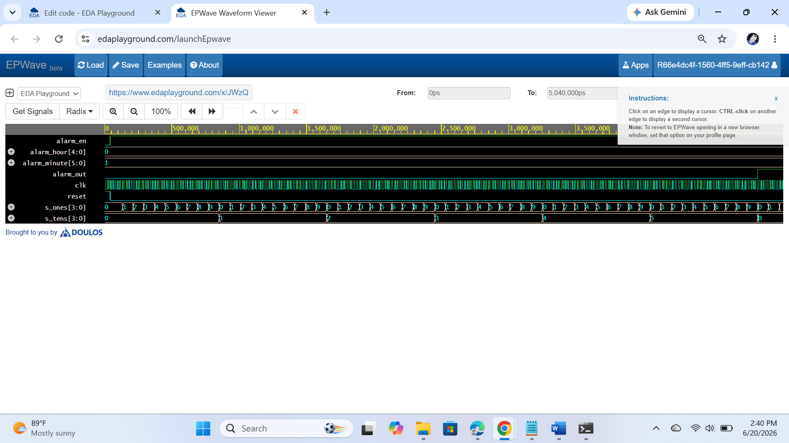
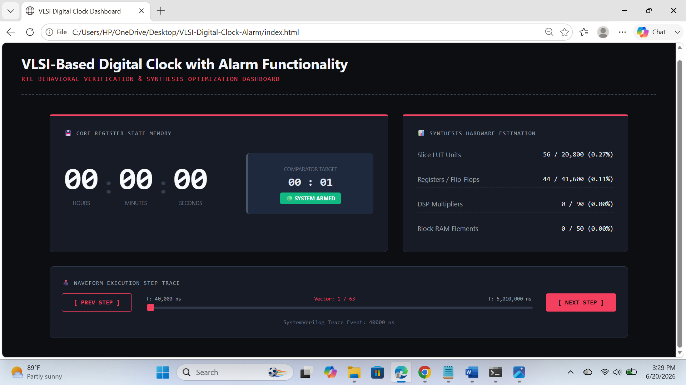
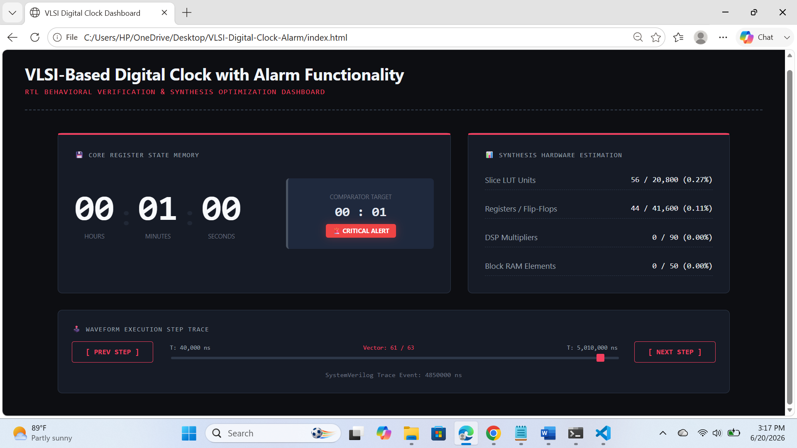

# VLSI-Based Digital Clock with Alarm Functionality

An industry-oriented SystemVerilog digital clock design featuring a modular cascade counter core, an equality-matching alarm engine, and an interactive behavioral verification dashboard. This project implements structural single-clock domain design principles optimized for clean synthesis execution.

Live Interactive Verification Panel: **[Insert Your Live GitHub Pages URL Here]**

---

## 🗺️ Project Architecture & Concepts
This project implements a single-domain synchronous digital system. Instead of utilizing divided clock lines directly (which causes hazardous clock skew), the system ingests a high-frequency system clock and drives all downstream logic via single-cycle synchronous enable pulses.

### System Workflow
1. **Clock Divider (`clock_div.sv`):** Counts system ticks to assert a 1Hz clock enable pulse.
2. **Cascaded Modulo Trackers (`time_counters.sv`):** Modulo-60 and Modulo-24 nested tracking logic tracking hours, minutes, and seconds safely formatted into Binary Coded Decimal (BCD) tokens.
3. **Alarm Comparator (`alarm_comp.sv`):** Purely combinational logic checking for bitwise equality between real-time tracking registers and set input registers.

---

## 📁 Repository Structure
Following strict digital engineering workspace layouts, this repository is organized into distinct structural folders:

```text
VLSI-Digital-Clock-Alarm/
│
├── rtl/                   # Synthesizable SystemVerilog Source Modules
│   ├── clock_div.sv
│   ├── time_counters.sv
│   ├── alarm_comp.sv
│   ├── seven_seg_mux.sv
│   └── digital_clock_top.sv
│
├── tb/                    # Self-Checking Verification Testbenches
│   └── digital_clock_tb.sv
│
├── simulation/            # Verification Script Infrastructure
│   ├── generate_dashboard.py
│   └── simulation_log.txt
│
├── images/                # Hardware & Verification Screenshots
│   ├── eda_playground_setup.png
│   ├── simulation_waveform.png
│   ├── dashboard_normal_mode.png
│   └── dashboard_critical_alert.png
│
├── .gitignore             # Git exclusion rules
├── index.html             # Premium interactive UI dashboard compiled output
└── README.md              # Core engineering documentation
```

---

## 🛠️ Tech Stack & Verification Environment
- **Hardware Description Language:** SystemVerilog (IEEE 1800-2012)
- **Virtual Simulation Compiler:** Icarus Verilog 12.0 via EDA Playground
- **Waveform Viewer:** EPWave Engine
- **Dashboard Compiler Engine:** Python 3.x (Log Parsing & Automation Script)
- **Hosting Platform:** GitHub Pages (Static hosting of the verification panel)

---

## 📊 Verification Metrics & Screenshots

### 1. Functional Waveform Capture
The system clearance pulse settles safely on start, initiating step counting sequentially without multi-clock setup or hold timing violations.


### 2. RTL Synthesis Footprint Metric Evaluation
The modular logic footprint calculates to less than 1% utilization overall on target modern Artix-7 fabric architectures:
- **Slice LUTs footprint:** `56 / 20800` (0.27%)
- **Registers / Flip-Flops:** `44 / 41600` (0.11%)

### 3. Behavioral Interactive Dashboard Panel
The custom automated verification helper maps the exact SystemVerilog timestamp logs into an interactive testing dashboard.

#### 🟢 Armed Stable Mode (`00:00:06`)
*Counters updating tracking frames steadily while checking comparator rules.*


#### 🚨 Critical Alarm Alert Fired (`00:01:00`)
*The precise moment the time register vectors click into exact equality with the target registers, causing the alarm bit line to drive active-high.*


---

## 🚀 How to Run & Regenerate Globally

To execute tests or update the dashboard interface locally:
1. Compile your design on EDA Playground using **Icarus Verilog 12.0** with **Open EPWave** checked.
2. Copy the printed text logging blocks from the console panel, saving it as `simulation_log.txt` inside the `simulation/` directory.
3. Open your terminal workspace inside the `simulation/` directory and run the engine:
   ```bash
   python generate_dashboard.py
   ```
4. The helper tool outputs the newly parsed grid mapping up into `index.html`. Commit and push updates to watch changes apply live over GitHub Pages!
